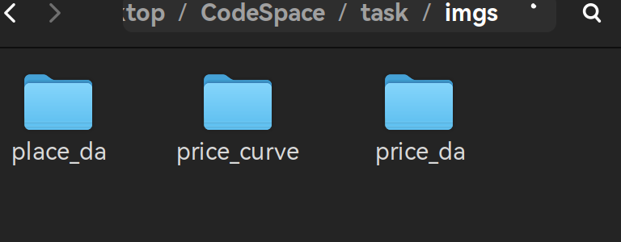
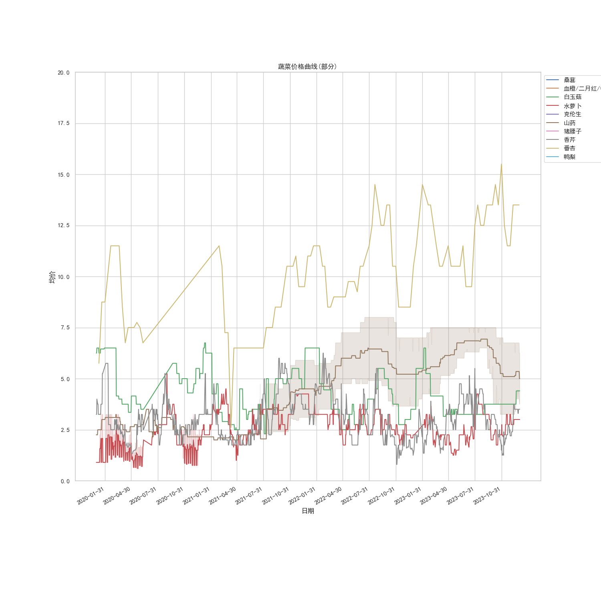
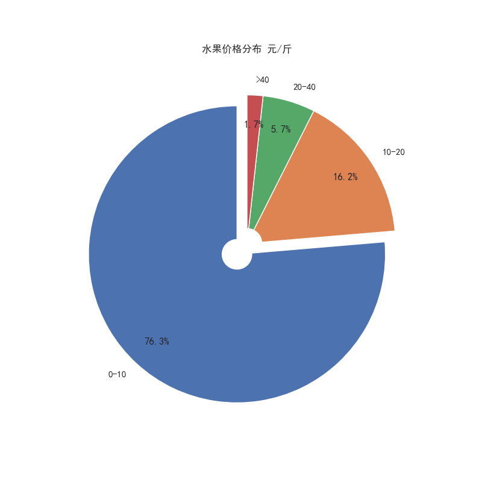
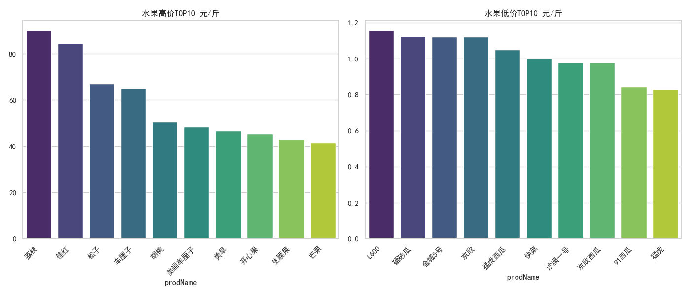

我们所拥有的食品批发数据为新发地批发市场的日用食品批发数据，数据集涵盖了多个方面。这些数据的综合分析将不仅有助于我们了解日常食品的交易情况、价格规律，也能使我们更好地理解食品批发市场的运作机制，为决策制定提供有力支持。

我们的分析旨在解答一系列关键问题，其中包括：

> 1. 商品的价格统计
>
> 2. 商品的价格分布
>
> 3. 商品的价格曲线
>
> 4. 商品与产地的潜在关系
> 5. 未完待续...

在本次分析任务中，我们使用的环境为

>  Ubuntu22.04,Conda23.7,Python3.11。

> 以Pycharm2023为开发平台，使用Jupyter Notebook进行代码编写。主要使用到的库为Pandas、Numpy、Matplotlib和Seaborn。

**结果展示：**

